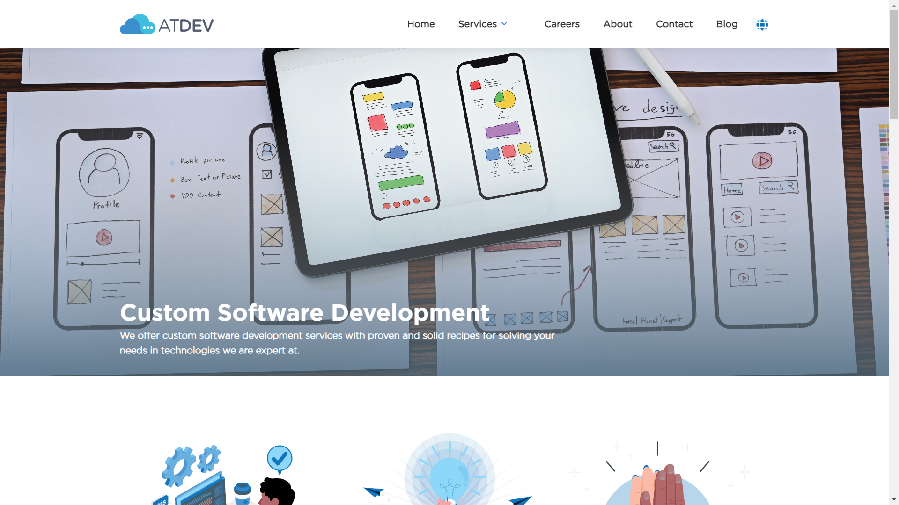
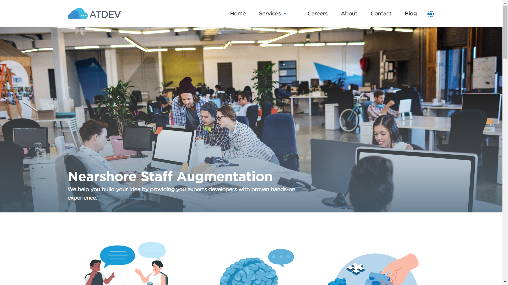

<!-- @format -->

# ATDEV.DO web site

Web site of atdev.do, this web site was made using Eleventy.

## Table of contents

-   [Overview](#overview)
    -   [The Content](#the-content)
    -   [Screenshot](#screenshot)
    -   [Built with](#built-with)
    -   [Useful resources](#useful-resources)
-   [Social Media](#social-media)
-   [Code Structure & Technologies](#code-structure--technologies)
-   [Run Application](#run-application)

## Overview

### The Content

In this web page you'll get to know a bit about us, what we offer and what we are aiming to:

-   You can check our services
-   You can contact us by sending an email

### Screenshot




## Social Media

-   Official Web Page - [Official Web Page](https://atdev.do/)
-   ATDEV on LinkedIn - [ATDEV](https://www.linkedin.com/company/atdev/about/)
-   ATDEV on Twitter - [@AtdevConsulting](https://twitter.com/AtdevConsulting)
-   ATDEV on Instagram - [@atdev.do](https://www.instagram.com/atdev.do/)

## Code Structure & Technologies

### Built with

-   Semantic HTML5 markup
-   CSS custom properties
-   CSS Grid
-   Flexbox
-   [11ty](https://www.11ty.dev/) - Static Site Generator

### Useful resources

-   [Eleventy](https://www.11ty.dev/docs/) - This amazing static site generator made it possible to build this site.
-   [Nunjucks](https://www.11ty.dev/docs/languages/nunjucks/) - This amazing template language helped us create some navigation functionality and some layouts.
-   [Google Fonts](https://fonts.google.com/) - This helped us find a good looking font for this web page.

### Web Page Folder Structure

```.
├── assets
├── lng
└── src
    ├── _data
        ├── navigation
        └── services
    ├── _includes
        └── layouts
    ├── pages
        ├── en
        └── es
    └── services
        ├── en
        └── es
```

### Run Application

#### NPM

##### Install dependencies

###### Downloads and install all the required modules

```.
npm install
```

##### Working locally

###### Starts watch tasks to compile when changes detected

```.
npm run dev
```

#### Creating a production build

###### Generates the files used in production

```.
npm run build
```
